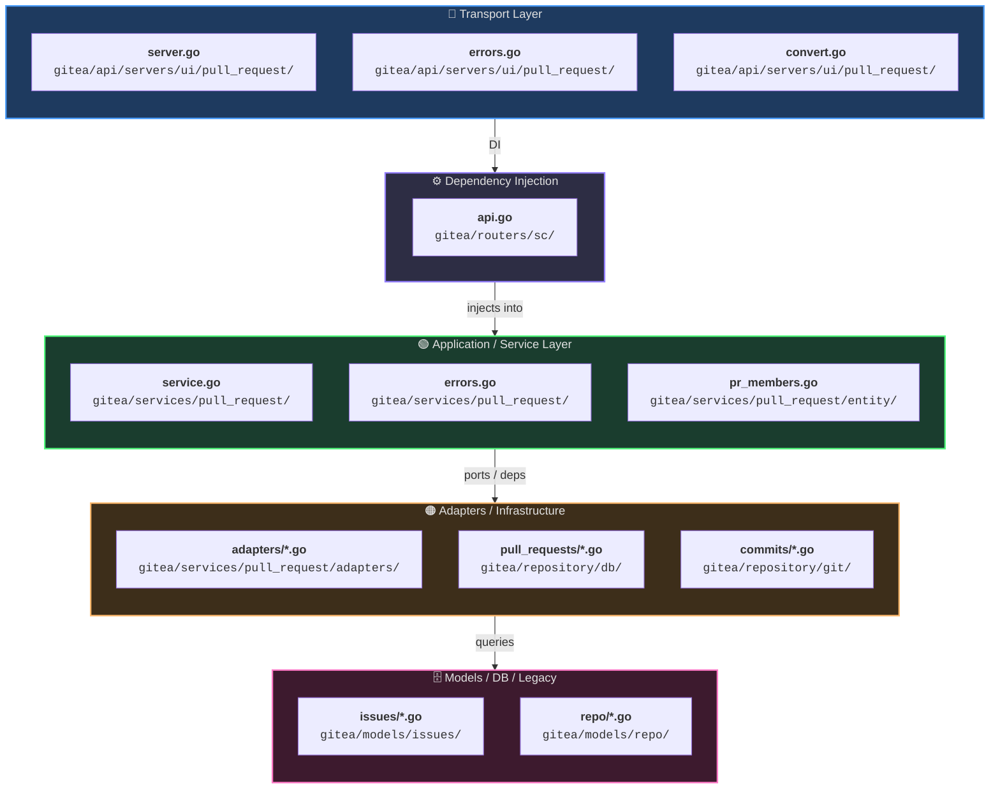
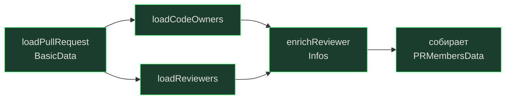
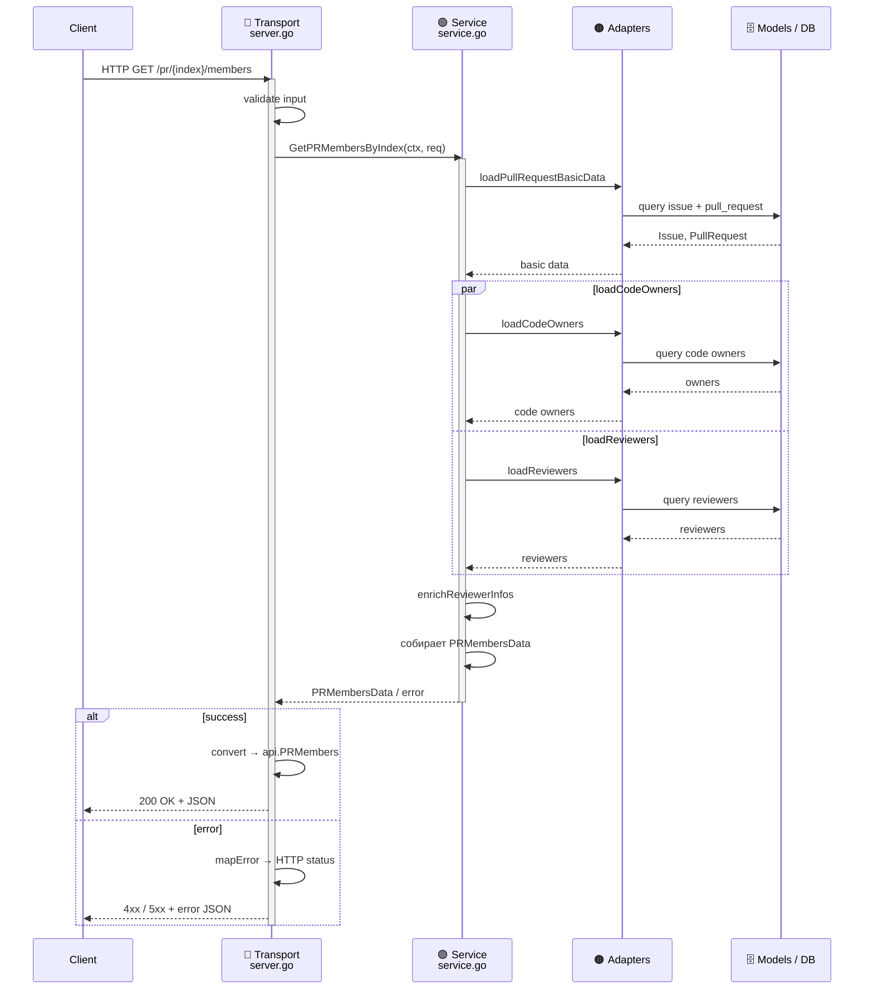

# PR Members — Архитектура

> Слоистая архитектура эндпоинта **GetPRMembersByIndex**: от HTTP-запроса до базы данных.

---

## Диаграмма слоёв

---

## Описание слоёв

### 🔷 Transport

| Файл | Назначение |
|---|---|
| `server.go` | Принимает HTTP / OpenAPI запрос, валидирует input, вызывает service |
| `errors.go` | Маппит service-ошибки → HTTP / OpenAPI response |
| `convert.go` | Конвертирует сервисные сущности → `api.PRMembers` |

**Путь:** `gitea/api/servers/ui/pull_request/`

---

### ⚙️ Dependency Injection

| Файл | Назначение |
|---|---|
| `api.go` | Связывает transport и service, внедряет зависимости |

**Путь:** `gitea/routers/sc/`

---

### 🟢 Application / Service

| Файл | Назначение |
|---|---|
| `service.go` | `GetPRMembersByIndex` — оркестрация use-case |
| `errors.go` | Доменные ошибки сервиса |
| `entity/pr_members.go` | Структура `PRMembersData` |

**Путь:** `gitea/services/pull_request/`

**Внутренний pipeline:**

---

### 🟠 Adapters / Infrastructure

| Файл | Назначение |
|---|---|
| `adapters/*.go` | Адаптация legacy-сервисов |
| `repository/db/pull_requests/*.go` | Доступ к БД |
| `repository/git/commits/*.go` | Доступ к Git-репозиторию |

---

### 🗄️ Models / DB / Legacy

| Файл | Назначение |
|---|---|
| `models/issues/*.go` | Issue / Pull Request модели, reviewers, assignees, watches |
| `models/repo/*.go` | Code owners, repo watch, issue watch |

---

## Поток данных (sequence)

