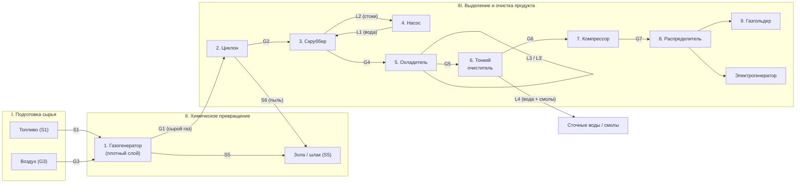

# Газификация ТГИ в плотном слое
## Технологическая схема газогенераторной установки

> Схема описана по аналогии со структурой образца (полукоксование угля): по стадиям процесса, с нумерацией аппаратов и индексацией материальных потоков (S — твёрдые, L — жидкие, G — газообразные).

---

## 1. Стадии технологического процесса

Процесс газификации твёрдых горючих ископаемых (ТГИ) в плотном слое разбивается на три укрупнённые стадии:

| № | Стадия | Что происходит |
|---|--------|----------------|
| **I** | **Подготовка сырья** | Загрузка топлива в бункер, дозирование, подача в шахту газогенератора, подвод воздушного дутья. |
| **II** | **Химическое превращение** | Газификация ТГИ в плотном слое: подсушка → пиролиз (полукоксование) → восстановление → горение → шлакообразование. Получение сырого генераторного газа. |
| **III** | **Выделение и очистка продукта** | Грубая очистка газа от пыли (циклон), мокрая очистка (скруббер), охлаждение, тонкая очистка от воды и углеводородов, компримирование, распределение к потребителю / в газгольдер. |

---

## 2. Описание процесса по аппаратам

### Стадия I. Подготовка сырья

**Аппарат 1 — Газогенератор (загрузочная часть).**
Уголь (поток **S1**) подаётся сверху в шахту, внутренние стенки которой выполнены из огнеупорного материала. Снизу через колосниковую решётку производится наддув воздуха (поток **G3**). Колосниковая решётка регулирует толщину слоя и отвод золы.

### Стадия II. Химическое превращение

**Аппарат 1 — Газогенератор (рабочие зоны плотного слоя).**
По высоте шахты последовательно располагаются зоны:

- **Зона сушки** (верх) — поднимающимися горячими газами топливо подсушивается; из **S1** получается **S2** (нагретый уголь).
- **Зона пиролиза (полукоксования)** — термическое разложение с выделением летучих и образованием полукокса **S3**.
- **Зона восстановления** — продукты горения (CO₂, H₂O), поднимаясь, контактируют с раскалённым коксом и восстанавливаются до **CO** и **H₂**.
- **Зона горения** — кислород дутья реагирует с углеродом кокса **S4**, обеспечивая теплоту процесса.
- **Зона шлака/золы** (низ) — остаток **S5** (зола, шлак) предварительно подогревает поступающий воздух.

На выходе из газогенератора получается сырой горячий генераторный газ **G1**, содержащий:
CO, H₂, CH₄, CO₂, H₂O, N₂ и пылевые частицы угля/золы.

### Стадия III. Выделение и очистка продукта

| № | Аппарат | Назначение |
|---|---------|------------|
| **2** | **Циклон** | Грубая (сухая) очистка генераторного газа от крупной угольной и зольной пыли за счёт центробежной сепарации. Уловленная пыль (**S6**) выводится в нижнюю часть. |
| **3** | **Скруббер** | Тонкое мокрое пылеудаление: газ промывается водой (**L1**), мелкая пыль и часть водорастворимых примесей переходят в жидкую фазу. |
| **4** | **Насос** | Подача воды **L1** в скруббер; отвод загрязнённой воды (**L2**) на сточные воды/регенерацию. |
| **5** | **Охладитель** | Снижение температуры газа после скруббера; теплоотвод технической водой (**L3** → **L3′**). |
| **6** | **Тонкий очиститель** | Очистка газа от остаточной влаги и углеводородов (смол, тяжёлых ароматических). Конденсат и смолы отводятся потоком **L4**. |
| **7** | **Компрессор** | Компримирование очищенного газа до давления сети потребителя; забор атмосферного воздуха для уплотнений/охлаждения **G3′**. |
| **8** | **Распределитель** | Распределение товарного генераторного газа по потребителям. |
| **9** | **Газгольдер** | Буферное хранение генераторного газа; сглаживание пиков потребления. Альтернативный потребитель — **электрогенератор**. |

---

## 3. Перечень оборудования (легенда к схеме)

```
1 — газогенератор (шахта плотного слоя с колосниковой решёткой);
2 — циклон (сухое пылеудаление);
3 — скруббер (мокрое тонкое пылеудаление);
4 — насос (подача орошающей воды);
5 — охладитель газа;
6 — тонкий очиститель (отделение воды и углеводородов);
7 — компрессор;
8 — распределитель генераторного газа;
9 — газгольдер.
```

---

## 4. Индексация материальных потоков

### Твёрдые потоки (S — Solid)
| Индекс | Поток |
|--------|-------|
| **S1** | уголь (исходное ТГИ, загрузка) |
| **S2** | подсушенный/нагретый уголь (после зоны сушки) |
| **S3** | полукокс (после зоны пиролиза) |
| **S4** | кокс (после зоны восстановления) |
| **S5** | зола, шлак (выгрузка из газогенератора) |
| **S6** | угольно-зольная пыль (улов циклона) |

### Жидкие потоки (L — Liquid)
| Индекс | Поток |
|--------|-------|
| **L1** | свежая вода на орошение скруббера |
| **L2** | загрязнённая вода (сточные воды) от скруббера |
| **L3** | техническая (охлаждающая) вода в охладитель |
| **L3′** | отработанная охлаждающая вода |
| **L4** | конденсат и углеводороды (смолы) из тонкого очистителя |

### Газовые потоки (G — Gas)
| Индекс | Поток |
|--------|-------|
| **G1** | сырой генераторный газ (выход из газогенератора) |
| **G2** | генераторный газ после циклона (без крупной пыли) |
| **G3** | воздух (дутьё в газогенератор) |
| **G3′** | воздух на компрессор |
| **G4** | газ после скруббера (мокрая очистка пройдена) |
| **G5** | охлаждённый газ (после охладителя) |
| **G6** | очищенный генераторный газ (после тонкого очистителя) |
| **G7** | товарный генераторный газ к потребителю / газгольдеру |

---

## 5. Граф-схема установки (по стадиям)



---

## 6. Линейная схема потоков (упрощённое представление)

```
S1 ─►[1 Газогенератор]──G1──►[2 Циклон]──G2──►[3 Скруббер]──G4──►[5 Охладитель]──G5──►
                ▲                 │                ▲                                  │
                │ G3              │ S6             │ L1                               │
              воздух          (пыль в шлак)    [4 Насос]                              ▼
                                                    ▲                       [6 Тонкий очиститель]
                                                    │ L2 (стоки)                      │
                                                                                       │ G6
                                                                                       ▼
                                                                                [7 Компрессор]
                                                                                       │ G7
                                                                                       ▼
                                                                                [8 Распределитель]
                                                                                  │       │
                                                                                  ▼       ▼
                                                                            [9 Газгольдер]  Электрогенератор

              S5 ◄── зола/шлак                                       L4 (вода + углеводороды) ◄── из (6)
```

---

## 7. Краткое описание принципа работы

1. **Загрузка топлива.** Уголь (**S1**) подаётся в шахту газогенератора (**1**) сверху. Снизу через колосниковую решётку нагнетается воздух (**G3**), который, проходя через слой золы и шлака, предварительно подогревается.
2. **Газификация в плотном слое.** В шахте последовательно идут процессы сушки, пиролиза, восстановления и горения. На выходе образуется сырой горячий генераторный газ (**G1**), содержащий CO, H₂, CH₄, CO₂, H₂O, N₂ и пылевые частицы. Зола и шлак (**S5**) выгружаются снизу.
3. **Сухая очистка.** В циклоне (**2**) от газа отделяются крупные твёрдые частицы (**S6**) под действием центробежной силы. Очищенный поток (**G2**) идёт на скруббер.
4. **Мокрая тонкая очистка.** В скруббере (**3**) газ промывается водой (**L1**), подаваемой насосом (**4**); тонкая пыль и часть растворимых примесей уходят с водой (**L2**) в сточные воды.
5. **Охлаждение.** В охладителе (**5**) промытый газ охлаждается технической водой (**L3 → L3′**) до температуры, необходимой для тонкой очистки.
6. **Тонкая очистка.** В аппарате тонкой очистки (**6**) из газа удаляются остаточная влага и углеводороды (смолы, **L4**).
7. **Компримирование.** Компрессор (**7**) повышает давление очищенного газа (**G6 → G7**) до уровня, требуемого потребителем.
8. **Распределение.** Распределитель (**8**) направляет товарный генераторный газ потребителям: на сжигание в электрогенераторе либо в газгольдер (**9**) для буферного хранения.

---

## 8. Соответствие с образцом (PDF)

| Образец (полукоксование) | Текущая схема (газификация в плотном слое) |
|--------------------------|--------------------------------------------|
| 1 — печь | 1 — газогенератор |
| 2 — зона сушки и предварительного нагревания | (входит в зоны газогенератора) |
| 3 — зона полукоксования | (входит в зоны газогенератора) |
| 4 — зона охлаждения | 5 — охладитель газа |
| 5 — камеры сгорания | (зона горения внутри 1) |
| 6 — зона предварительного охлаждения | 5 — охладитель |
| 7 — сетчатый фильтр | 2 — циклон + 3 — скруббер |
| 8 — холодильник | 5 — охладитель |
| 9 — сепаратор | 6 — тонкий очиститель |
| — | 4 — насос, 7 — компрессор, 8 — распределитель, 9 — газгольдер |

> Таким образом, в отличие от схемы полукоксования, в установке газификации в плотном слое **все термические зоны (сушка, пиролиз, восстановление, горение)** объединены в одном аппарате — газогенераторе, а блок очистки и подготовки товарного газа существенно расширен (циклон + скруббер + охладитель + тонкий очиститель + компрессор + распределитель + газгольдер).
